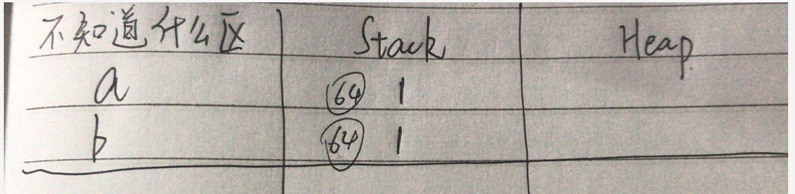
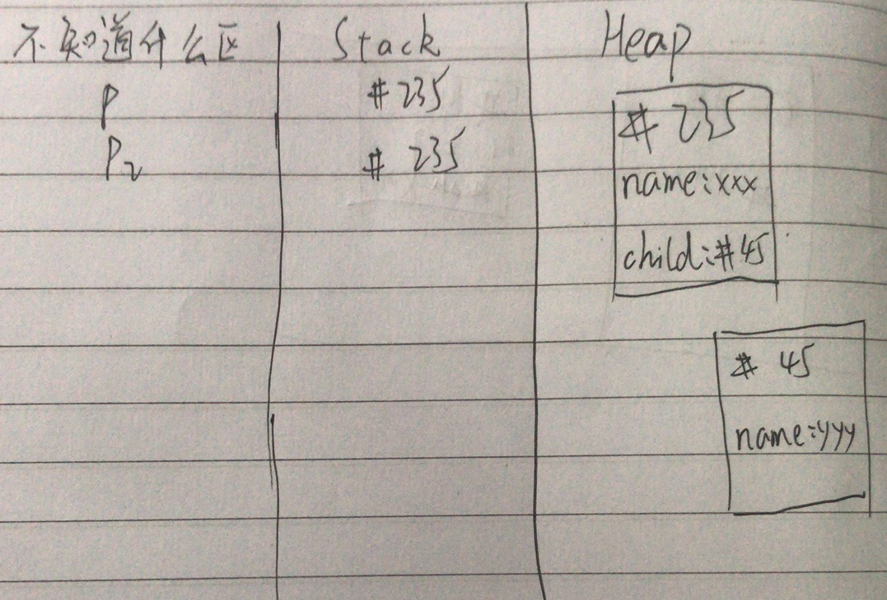
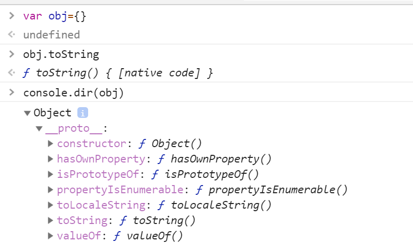
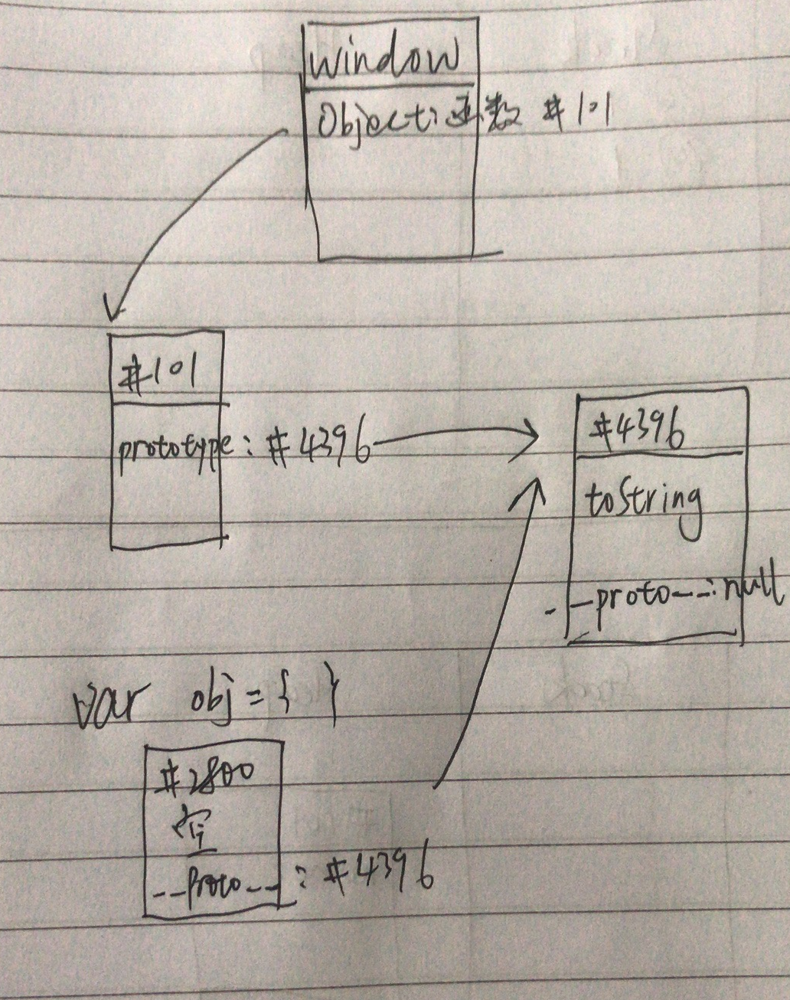
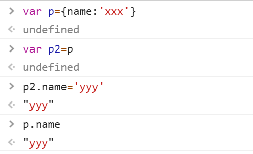
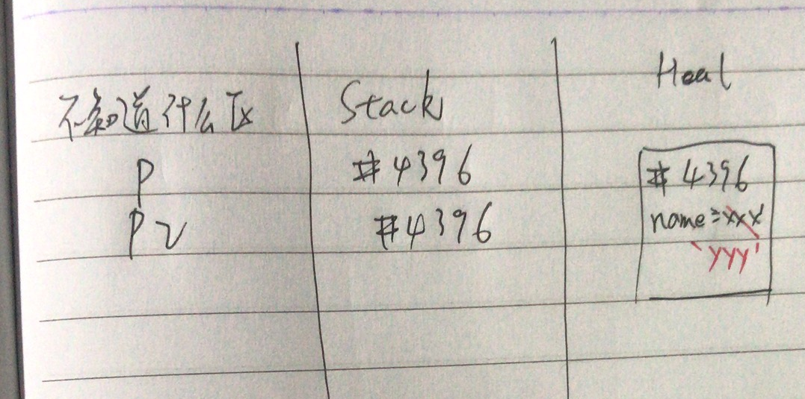
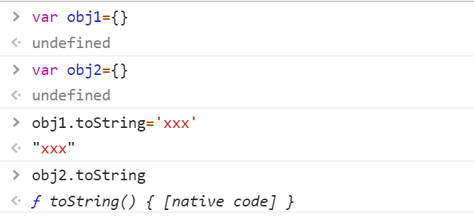
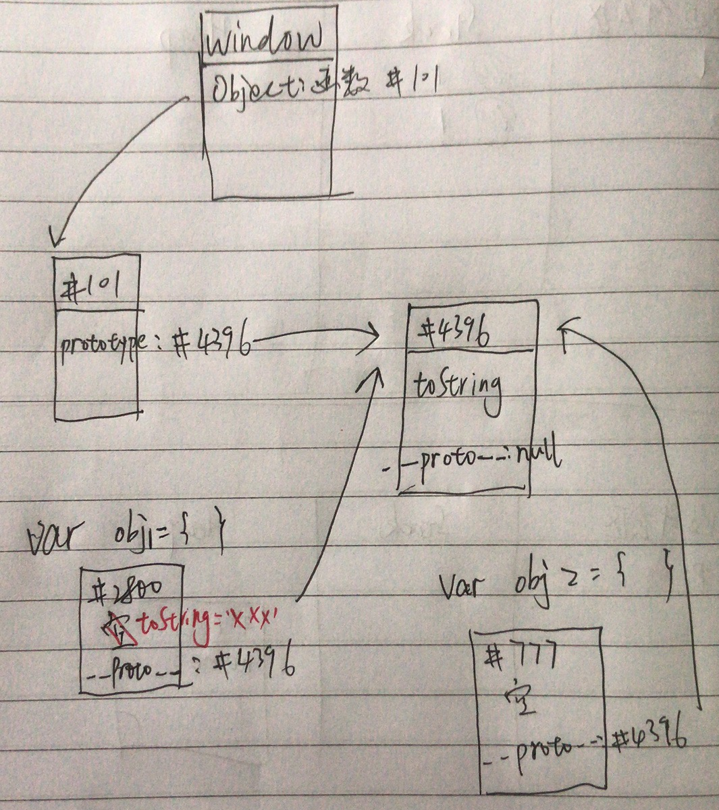
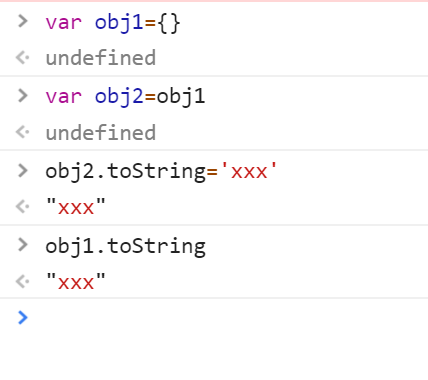

# JavaScript的数据存储与地址篡改
## 1. Javascript的数据存储
简单的可以分为三个区：
1. 不知道什么区（每种浏览器分配规则不一样），用来存储变量。
2. Stack栈，每个数据有顺序的存放。用于存储对象（存储非对象，主要是数字，字符串还有bool）。
3. Heal堆，每个数据随机存放。用于存储对象。
   
举例：
1. 例一
```js
var a=1
var b=a
```
如图：

2. 例二
```js
var p={name:'xxx'
child:{name:'yyy'}
}
var p2=p
```
如图：


## 2. 原型链 prototype
* xxx.prototype存储了xxx对象的共同属性，这就是原型
* 原型可以让你无需重复共有属性，圣代码，省内存
* 每个对象都有隐藏属性，指向原型
* 隐藏属性叫做__proto__

举例：
```js
var obj={}
obj.toString()
```

上面这个代码不会报错，虽然obj{}里面并没有toString这个属性，它的原模型是Object，它的隐藏属性里面就有toString。

具体过程为：
1. 在obj{}里面发现没有toString
2. 就会沿着原型链找到它的原型Object
3. Object里面有一个隐藏属性__proto__
4. 隐藏属性里面有toString
5. 所以最后找到的是Object.prototype.toString

可以抽象为一种更简单的画法：



# 3. 地址篡改
有了上面两个例子后，就可以很好地解释几个地址篡改的现象.
1. 例一：
```js
var p={
    name=xxx
}
var p2=p
p2.name='yyy'
```
那么这时候p.name是什么呢?

答案如图：

p.name='yyy'。原因很简单，这时候只要再画一张图就可以很好的解释了：

但你输入p2.name='yyy'时，他改变的是#4396里面的属性值，但是p对应的地址也是#4396，所以它的name值也改变了。
2. 例二：
```js
var obj1={}
var obj2={}
obj1.toString='xxx'
```
这时候obj2.toString是否也为xxx呢？

答案如图：

obj2.toString不会被篡改，也可以用一张图解释:
                                    因为输入obj1.toString='xxx'后，修改的是+2800里面的内容，然而obj2.toString对应的内容还是在#4396里面。

 3. 例三：
```js
var obj1={}
var obj2={}
obj2.toString='xxx'
```
这时候obj1.toString是否也为xxx呢？

答案如图：

 
 原因也可以用一张图解释：
 
